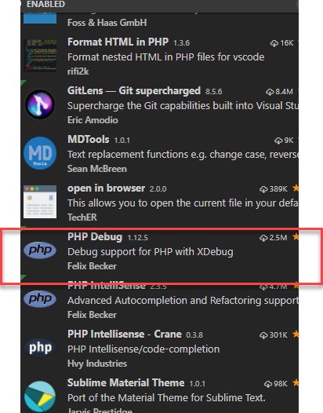

*vscode真的是越来越牛了啊，竟然可以方便的调试php，这边记录一下教程，也是网上看来的
**所需文件:
    1. xampp 集成服务器（也可以就是apache/IIS）
    2. vscode
    3. Xdebug
    4. php-debug 插件
**配置过程：
***1. 在Xampp(Apache/IIS)中安装xdebug:
    a.去 https://xdebug.org/download.php下载php对应版本的插件，php版本可以在xampp中的readme看到，下载这个php_xdebug-2.7.0alpha1-7.2-vc15(32位) 把dll文件拷贝到php/ext目录
    
    b.打开php目录下的php.ini ，添加几行配置，xdebug的路径按实际情况配置，配置完成后重启apache服务器
    zend_extension=C:\xampp\php\ext\php_xdebug-2.7.0alpha1-7.2-vc15.dll
    [XDebug]
    xdebug.remote_enable = 1
    xdebug.remote_autostart = 1
    
    配置好后重启Apache，然后找个文件输出phpinfo, 如果能看到类似下图，说明就成功了
    
***2. 在vscode中安装php debug插件
    这个不用多介绍直接看图
    
    接着打开usersetting,add:
    

    最后的最后，你就可以debug了，像这样
    
    

